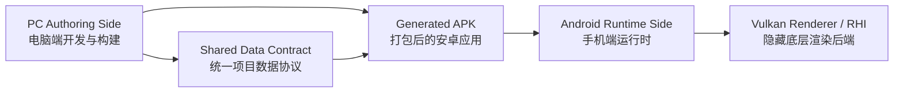
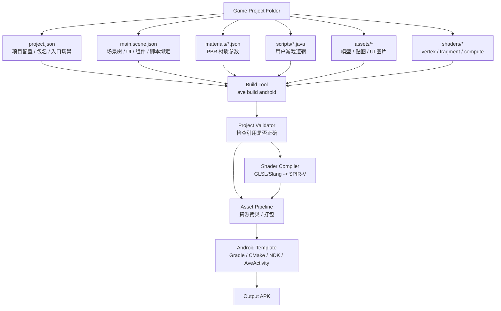
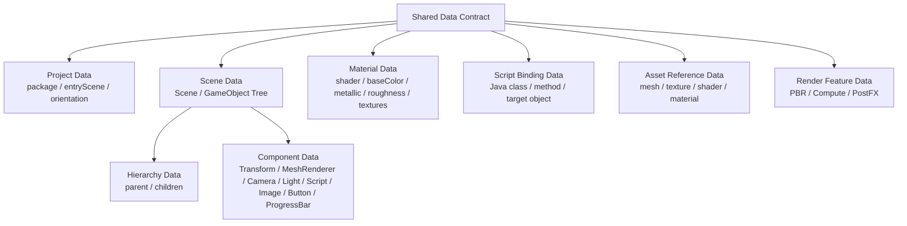
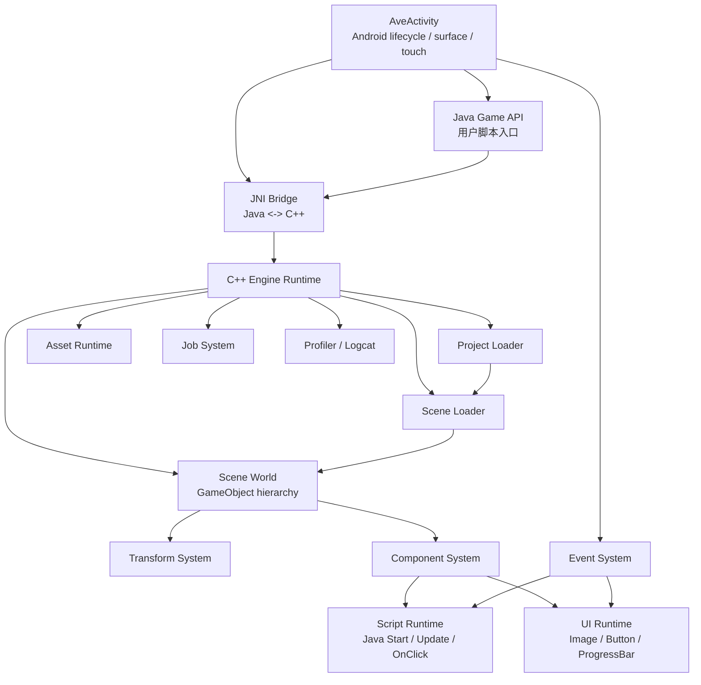
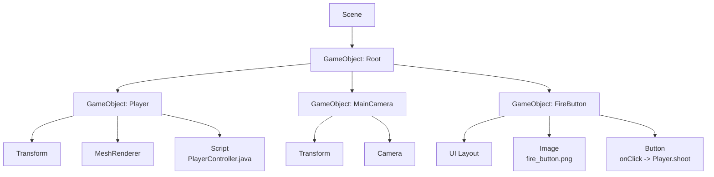
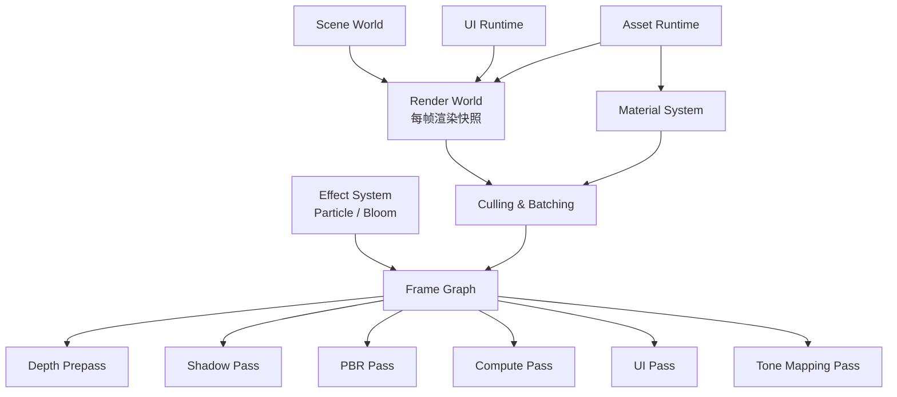
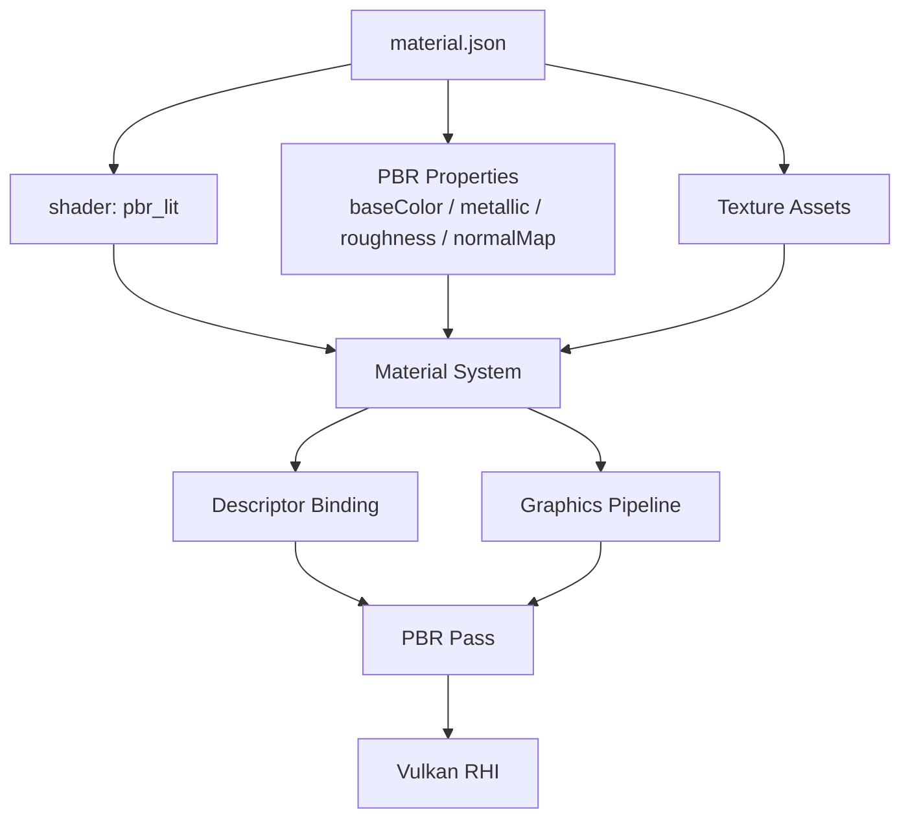
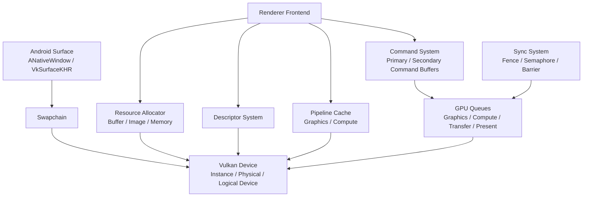
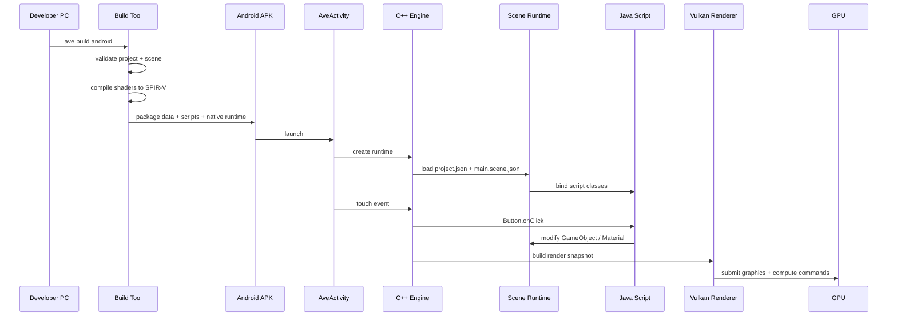

# Android Vulkan Mini Game Engine Architecture

## 项目目的

本项目目标是实现一个面向 Android 小型游戏开发者的轻量游戏引擎。开发者在 PC 上通过统一的项目文件和场景文件描述游戏对象、UI、材质、shader 和 Java 逻辑，然后通过构建工具生成 Android APK。手机端运行时由 C++ Engine Runtime 和 Vulkan Renderer 负责加载项目数据、执行脚本、处理输入并完成渲染。

这个项目不是单纯的 Vulkan Demo，而是一个 **PC Authoring + Android Vulkan Runtime** 的迷你 Unity-like 引擎原型。开发者不需要理解 Vulkan、NDK、Android Surface、descriptor、pipeline、同步等底层细节。

## 1. 总体大架构



整体流程：

```text
开发者在 PC 上开发
  -> 生成统一数据
  -> Build Tool 打包成 APK
  -> Android Runtime 加载数据
  -> Vulkan 后端负责渲染
```

## 2. PC Authoring Side



| 模块 | 职责 |
|---|---|
| `project.json` | 定义项目名称、包名、入口场景、横竖屏等全局配置 |
| `main.scene.json` | 统一描述场景树、GameObject、组件、UI 和脚本绑定 |
| `materials/*.json` | 描述 PBR 材质参数、shader 引用和贴图引用 |
| `scripts/*.java` | 开发者编写的游戏逻辑 |
| `assets/*` | 模型、贴图、UI 图片等游戏资源 |
| `shaders/*` | vertex、fragment、compute shader 源文件 |
| `Build Tool` | 一键校验项目、编译 shader、打包资源、生成 APK |
| `Android Template` | 固定 Gradle、CMake、NDK、Activity、native runtime 工程模板 |

## 3. Shared Data Contract



这层是 PC 端和 Android Runtime 之间的协议。PC 端怎么写，Android 端就按同一套数据结构加载。

场景层级关系属于：

```text
Scene Data
  -> GameObject Tree
  -> parent / children
  -> Component Data
```

UI 不单独拆成独立文件，而是场景树中的 GameObject：

```text
GameObject: FireButton
  -> UI Layout
  -> Image
  -> Button
```

## 4. Android Runtime Side



| 模块 | 职责 |
|---|---|
| `AveActivity` | 隐藏 Android lifecycle、surface、touch 输入 |
| `Java Game API` | 给开发者提供简单 Java 逻辑入口 |
| `JNI Bridge` | 负责 Java 和 C++ runtime 通信 |
| `C++ Engine Runtime` | 管理 main loop、scene、asset、event、script |
| `Project Loader` | 加载 `project.json` |
| `Scene Loader` | 加载 `main.scene.json` 并创建场景 |
| `Scene World` | 维护 GameObject hierarchy |
| `Transform System` | 更新父子层级和 local/world matrix |
| `Component System` | 管理组件生命周期和 update dispatch |
| `Script Runtime` | 调用 Java `Start`、`Update`、`OnClick` |
| `UI Runtime` | 处理 Image、Button、ProgressBar 和点击命中 |
| `Asset Runtime` | 加载 APK 内的 mesh、texture、material、SPIR-V |
| `Job System` | 支持异步资源加载和多线程任务 |

## 5. Scene / Component 架构



这一层要保持 Unity-like 思路：

```text
所有东西都是 GameObject
UI 也是 GameObject
行为通过 Component 扩展
```

## 6. Render Frontend



Render Frontend 负责把游戏世界变成渲染任务：

```text
GameObject / UI / Material
  -> RenderWorld
  -> FrameGraph
  -> Render Pass / Compute Pass
```

## 7. Material / PBR 架构



开发者看到的是材质配置：

```json
{
  "shader": "pbr_lit",
  "metallic": 0.5,
  "roughness": 0.3
}
```

底层实际完成 descriptor 更新、pipeline 选择、uniform/texture 绑定和 PBR pass 渲染。

## 8. Vulkan RHI 内部架构



Vulkan RHI 完全对用户隐藏。用户只需要创建对象、材质、UI 和脚本，不直接接触 Vulkan API。

## 9. Build 到运行完整流程



## 一个月 MVP 范围

| 模块 | MVP 范围 |
|---|---|
| `Project Format` | `project.json` + `main.scene.json` + `materials/*.json` |
| `Build Tool` | 校验引用、编译 shader、拷贝资源、调用 Gradle |
| `Scene Runtime` | GameObject hierarchy、Transform、MeshRenderer、Camera、Light |
| `UI Runtime` | Image、Button、ProgressBar，不做字体 |
| `Script Runtime` | Java `Start`、`Update`、`OnClick` |
| `Material System` | basic PBR 参数绑定 |
| `Renderer` | PBR mesh、UI pass、tone mapping |
| `Compute` | GPU particle 或 compute bloom 二选一 |
| `Vulkan RHI` | 最小 device、swapchain、resource、descriptor、pipeline、command、sync |
| `Profiler` | logcat 输出 frame time、pass time、draw call |

## 两人纵向分工

不要按底层/上层切分，而是按完整功能链路切分。

| 人员 | 负责方向 | 完整链路 |
|---|---|---|
| A | Scene + Material + PBR | `scene/material data -> runtime load -> MaterialSystem -> PBR Pass -> Vulkan graphics pipeline` |
| B | UI + Script + Compute | `UI component/script binding -> Java callback -> UI/Compute Pass -> Vulkan compute pipeline` |

共同负责：

```text
Project Format
Engine Runtime lifecycle
Vulkan RHI abstraction
Build pipeline
README / architecture / demo video / performance report
```

## 最终 Demo

```text
PC:
  编辑 project.json、main.scene.json、material.json、PlayerController.java
  运行 ave build android

Android:
  APK 启动
  自动加载场景
  显示 3D 物体 + PBR 材质
  显示图片按钮和进度条 UI
  点击按钮调用 Java 脚本
  触发 compute particle 或 bloom 效果
  Vulkan backend 完全隐藏在 engine 内部
```
