# Android Vulkan Mini Game Engine Architecture

## 项目目的

本项目目标是实现一个面向 Android 小型游戏开发者的轻量游戏引擎。开发者在 PC 上通过统一的项目文件和场景文件描述游戏对象、UI、材质、shader 和 Java 逻辑，然后通过构建工具生成 Android APK。手机端运行时由 C++ Engine Runtime 和 Vulkan Renderer 负责加载项目数据、执行脚本、处理输入并完成渲染。

这个项目不是单纯的 Vulkan Demo，而是一个 **PC Authoring + Android Vulkan Runtime** 的迷你 Unity-like 引擎原型。开发者不需要理解 Vulkan、NDK、Android Surface、descriptor、pipeline、同步等底层细节。

## 1. 总体大架构

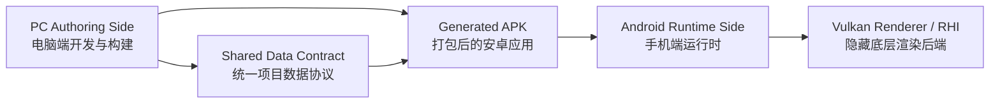

整体流程：

```text
开发者在 PC 上开发
  -> 生成统一数据
  -> Build Tool 打包成 APK
  -> Android Runtime 加载数据
  -> Vulkan 后端负责渲染
```

## 2. PC Authoring Side

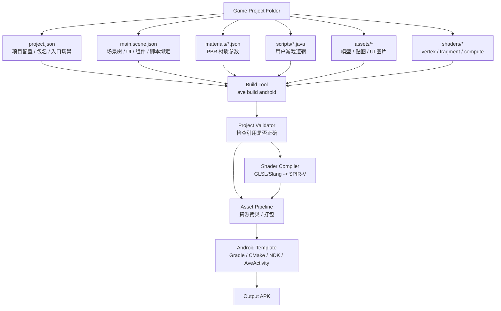

| 模块 | 职责 |
|---|---|
| `project.json` | 定义项目名称、包名、入口场景、横竖屏等全局配置 |
| `main.scene.json` | 统一描述场景树、GameObject、组件、UI 和脚本绑定 |
| `materials/*.json` | 描述 PBR 材质参数、shader 引用和贴图引用 |
| `scripts/*.java` | 开发者编写的游戏逻辑 |
| `assets/*` | 模型、贴图、UI 图片等游戏资源 |
| `shaders/*` | vertex、fragment、compute shader 源文件 |
| `Build Tool` | 一键校验项目、编译 shader、打包资源、生成 APK |
| `Android Template` | 固定 Gradle、CMake、NDK、Activity、native runtime 工程模板 |

## 3. Shared Data Contract

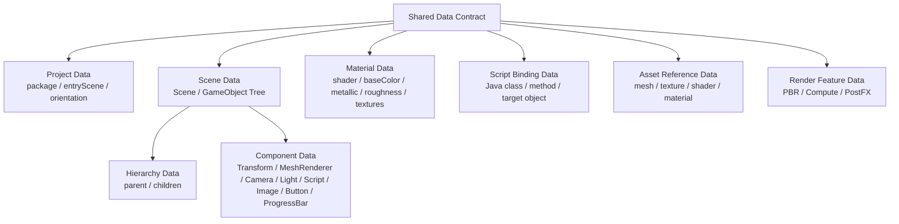

这层是 PC 端和 Android Runtime 之间的协议。PC 端怎么写，Android 端就按同一套数据结构加载。

场景层级关系属于：

```text
Scene Data
  -> GameObject Tree
  -> parent / children
  -> Component Data
```

UI 不单独拆成独立文件，而是场景树中的 GameObject：

```text
GameObject: FireButton
  -> UI Layout
  -> Image
  -> Button
```

## 4. Android Runtime Side

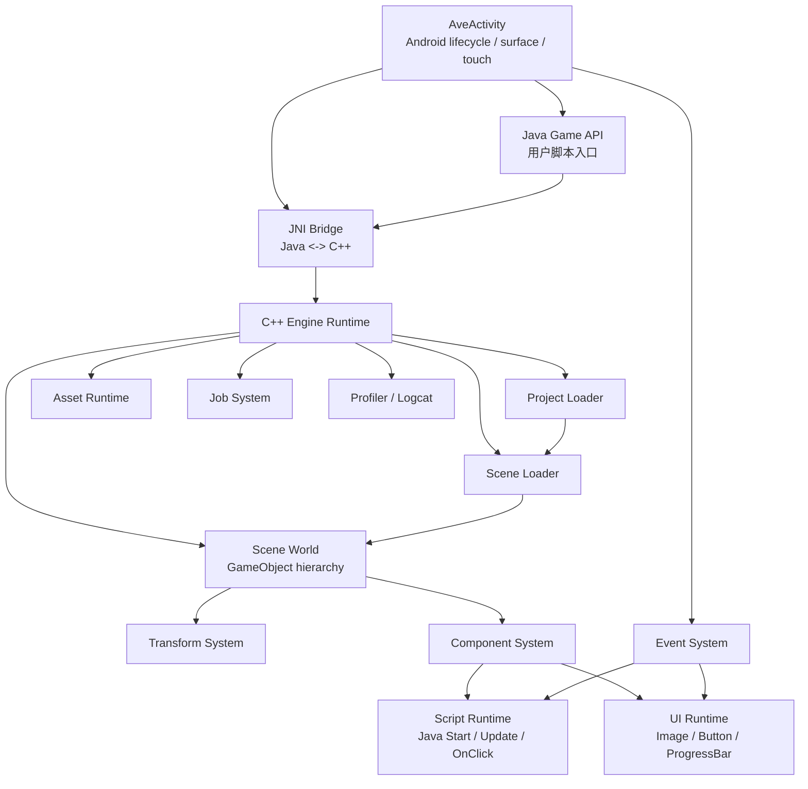

| 模块 | 职责 |
|---|---|
| `AveActivity` | 隐藏 Android lifecycle、surface、touch 输入 |
| `Java Game API` | 给开发者提供简单 Java 逻辑入口 |
| `JNI Bridge` | 负责 Java 和 C++ runtime 通信 |
| `C++ Engine Runtime` | 管理 main loop、scene、asset、event、script |
| `Project Loader` | 加载 `project.json` |
| `Scene Loader` | 加载 `main.scene.json` 并创建场景 |
| `Scene World` | 维护 GameObject hierarchy |
| `Transform System` | 更新父子层级和 local/world matrix |
| `Component System` | 管理组件生命周期和 update dispatch |
| `Script Runtime` | 调用 Java `Start`、`Update`、`OnClick` |
| `UI Runtime` | 处理 Image、Button、ProgressBar 和点击命中 |
| `Asset Runtime` | 加载 APK 内的 mesh、texture、material、SPIR-V |
| `Job System` | 支持异步资源加载和多线程任务 |

### 4.1 Input / UI Event 模块设计

当前目标是避免每个 Java 脚本直接抢 `dispatchTouchEvent`，而是让引擎统一处理原始触摸、UI 命中、事件消费和脚本回调。这样按钮、Slider、相机拖动不会各算各的点击区域，也不会出现某个 UI 区域被其他脚本截断导致不响应的问题。

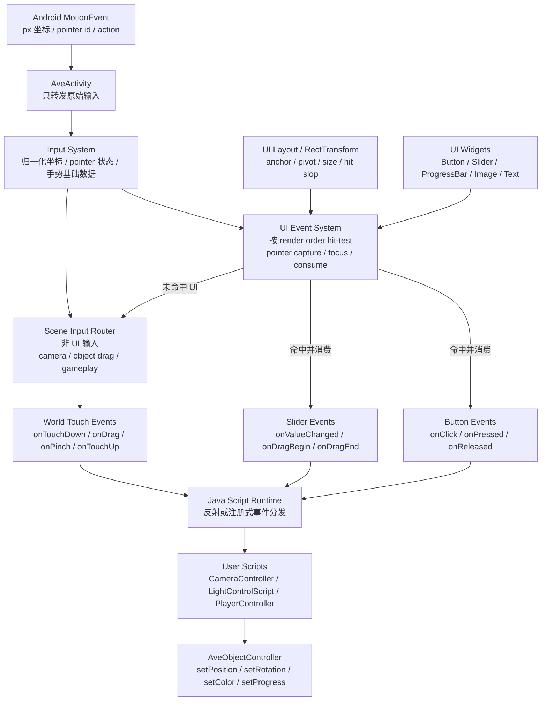

推荐职责边界：

| 模块 | 应该负责 | 不应该负责 |
|---|---|---|
| `AveActivity` | 接收 Android 原始事件并转给引擎 | 自己判断按钮、Slider、相机逻辑 |
| `Input System` | 维护 pointer 状态、坐标转换、基础手势数据 | 调用具体游戏脚本方法 |
| `UI Event System` | 根据 `RectTransform` 和渲染顺序做 hit-test、消费事件 | 让每个脚本重复计算 UI 命中 |
| `Button` | 产生 `onClick/onPressed/onReleased` | 直接写游戏逻辑 |
| `Slider` | 处理拖动并产生 `onValueChanged(value)` | 被当成只能显示的 `ProgressBar` |
| `ProgressBar` | 只显示数值进度 | 处理拖动输入 |
| `Java Script` | 响应引擎派发的事件并修改对象状态 | 抢全局 `dispatchTouchEvent` 并自己决定事件归属 |

推荐 XML 表达：

```xml
<GameObject id="switch_mode_button" name="Switch Mode">
    <RectTransform anchor="bottom-center" pivot="0.5,0.5" position="0,-48" size="180,64" />
    <Image texture="textures/tanslate.png" />
    <Button target="CameraController" onClick="switchMode" />
    <Text value="INTERACT" />
</GameObject>

<GameObject id="light_x_slider" name="Light X Slider">
    <RectTransform anchor="left-center" pivot="0.5,0.5" position="80,0" size="260,40" />
    <Slider min="-8" max="8" value="0" target="LightControlScript" onValueChanged="setLightX" />
</GameObject>
```

事件流：

```text
MotionEvent
  -> Input System
  -> UI Event System hit-test top-most widget
  -> if Button: onClick(target.method)
  -> if Slider: update value + onValueChanged(target.method(value))
  -> if no UI hit: route to camera/gameplay touch callbacks
```

## 5. Scene / Component 架构

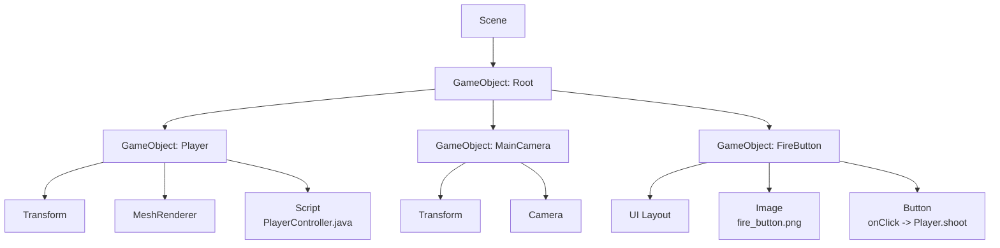

这一层要保持 Unity-like 思路：

```text
所有东西都是 GameObject
UI 也是 GameObject
行为通过 Component 扩展
```

## 6. Render Frontend

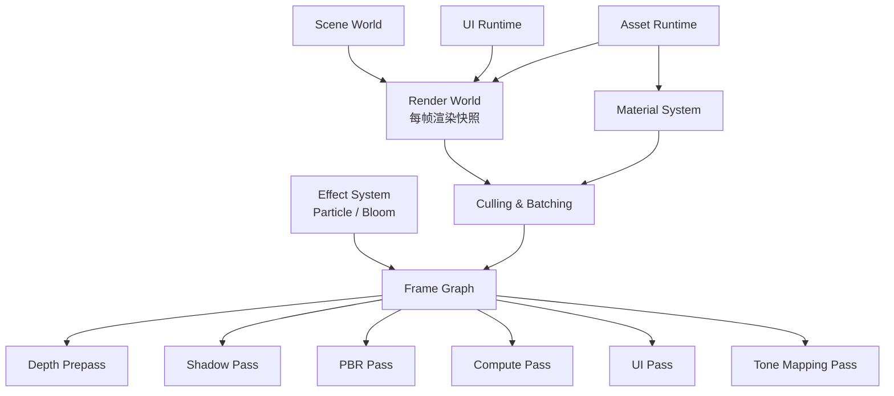

Render Frontend 负责把游戏世界变成渲染任务：

```text
GameObject / UI / Material
  -> RenderWorld
  -> FrameGraph
  -> Render Pass / Compute Pass
```

### 6.1 Runtime Resource & Pipeline 管理（FrameData 驱动）

> 补充说明：当前 sample 侧以 `project.xml / *.scene.xml` 为主，但整体分层（SharedDataContract → Runtime → Renderer）不依赖具体文件格式。

渲染层每帧接收到的核心数据结构是：`include/ave/core/FrameData.h` 中的 `ave::core::FrameData`。

- `FrameData.renderables`：本帧要画的 draw item 列表（每个元素提供 `mesh_id/material_id/world + draw range + shadow flags`）
- `FrameData.ui_items`：本帧要画的 UI draw item 列表（提供 `material_id/texture_id + rect`）
- `FrameData.resources`：本帧“声明式资源需求表”（meshes/materials/textures 的 id 列表，用于资源预取/确保就绪）

渲染层不从 `FrameData` 携带顶点/纹理等大块数据；它只携带 **id**。GPU 资源由 runtime manager 复用与缓存：

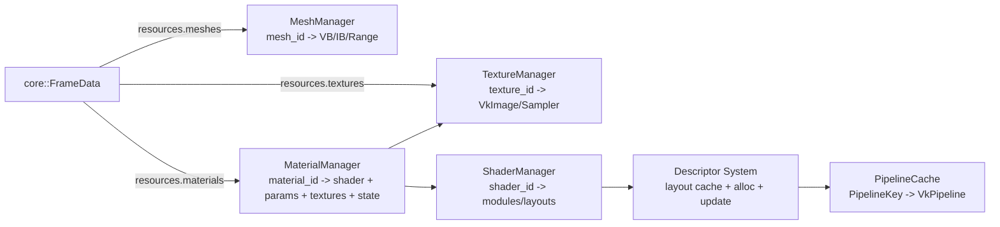

更详细的“Components → ResourceManager → FrameData → Pass 过滤”数据流与字段约定见：`docs/frame_data_contract_zh.md`。

### 6.2 两个关键子模块：Resource System / Pipeline & Descriptor System

**A) Resource System（复用 mesh/material/texture/shader）**

职责：把 `FrameData`/场景里出现的字符串 id 映射成可复用的 runtime 句柄（并进行缓存/热重载/异步加载）。

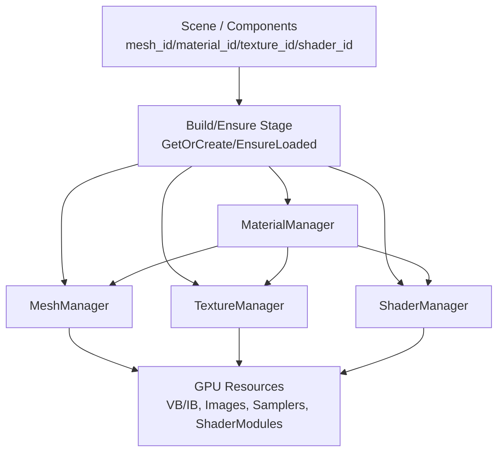

**B) Pipeline & Descriptor System（按需创建/复用 VkPipeline + set 布局）**

目标：同一个 pass 内不同 object 允许使用不同 pipeline；相同 key 的 pipeline/layout 可复用。

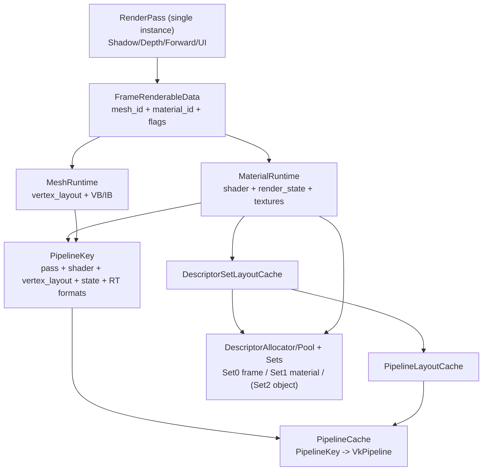

## 7. Material / PBR 架构

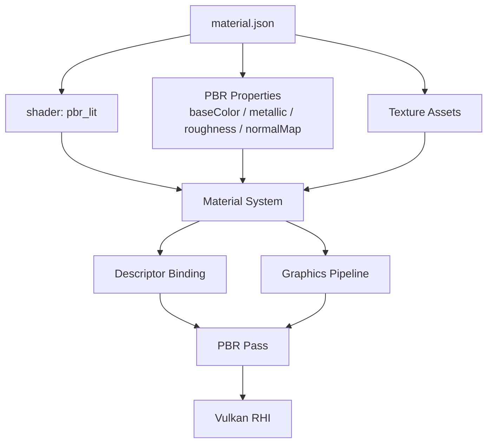

开发者看到的是材质配置：

```json
{
  "shader": "pbr_lit",
  "metallic": 0.5,
  "roughness": 0.3
}
```

底层实际完成 descriptor 更新、pipeline 选择、uniform/texture 绑定和 PBR pass 渲染。

## 8. Vulkan RHI 内部架构

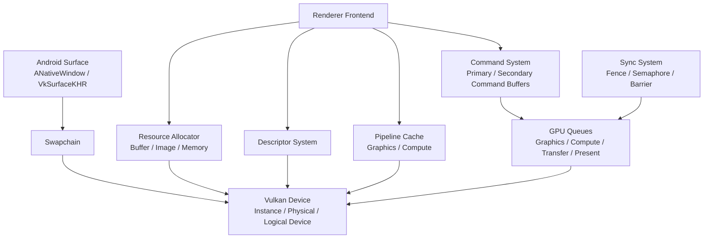

Vulkan RHI 完全对用户隐藏。用户只需要创建对象、材质、UI 和脚本，不直接接触 Vulkan API。

## 9. 普通模式 + VR 模式共存架构

如果引擎要同时支持“普通手机/窗口渲染”和“VR 设备渲染”，核心原则是：

```text
Renderer 不应该直接依赖 Android Surface / VkSwapchain。
Renderer 只应该接收“本帧要画到哪里”的 RenderTarget。

Android 普通模式负责提供 swapchain image。
OpenXR VR 模式负责提供 XR swapchain image。
Renderer / FrameGraph / RenderPass 只关心 RenderTarget、Camera/View、FrameData。
```

### 9.1 当前问题

当前渲染链路更接近：

```text
AveActivity
  -> minimal_vulkan_triangle
  -> Android Surface / VkSwapchain
  -> Renderer::RenderFrameGraphFrame
  -> FrameGraph
  -> Shadow / Depth / Skybox / PBR / UI
  -> Present 到 Android Surface
```

这条链路能跑普通 Android，但它把“获取 swapchain image、渲染、present”绑在同一条路径里。VR 接入后会遇到几个结构性问题：

| 问题 | 普通模式 | VR 模式 |
|---|---|---|
| 输出目标 | Android `VkSwapchainKHR` image | OpenXR `XrSwapchain` image |
| 相机数量 | 1 个 view | 左眼/右眼 2 个 view |
| Present | Vulkan present queue | `xrEndFrame` 提交 composition layer |
| 帧时间 | App 自己算 delta time | 使用 OpenXR predicted display time |
| 输入 | Android touch | XR controller / hand / head pose |

所以不要把 VR 硬塞进 `minimal_vulkan_triangle.cpp` 里，而是先把平台输出目标抽象出来。

### 9.2 推荐目标架构

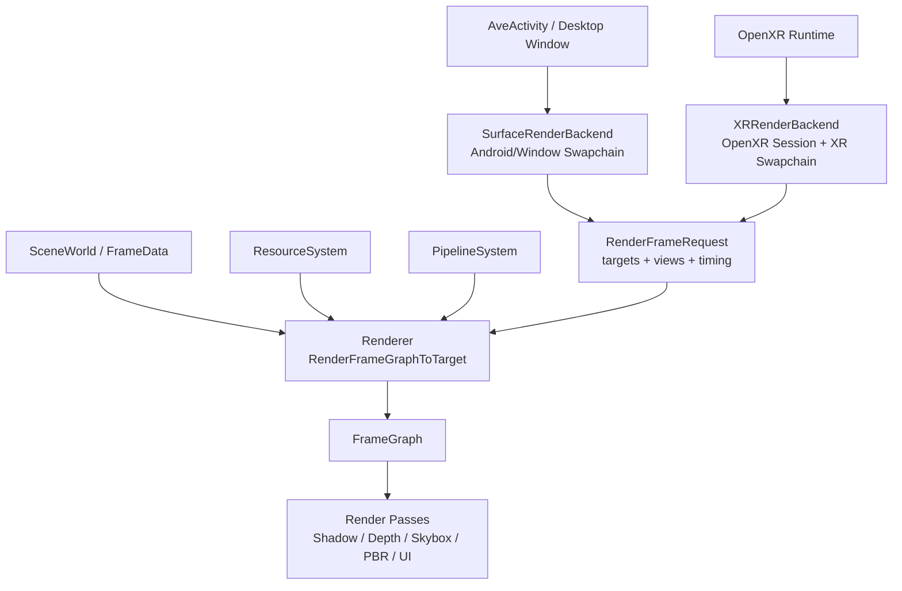

普通模式和 VR 模式的区别应该只发生在“帧来源”和“最终提交”：

| 层级 | 普通模式 | VR 模式 | 是否复用 |
|---|---|---|---|
| SceneWorld | 同一套场景 | 同一套场景 | 复用 |
| ResourceSystem | 同一套 mesh/texture/material | 同一套 mesh/texture/material | 复用 |
| PipelineSystem | 复用大部分 pipeline cache | pipeline key 需要增加 view/format 信息 | 大部分复用 |
| FrameGraph | 同一套 pass 编排 | 同一套 pass 编排，可按 eye 执行 | 复用 |
| RenderPass | 画到普通 target | 画到 XR eye target | 复用但要去 swapchain 化 |
| UI Runtime | 2D 屏幕 UI | 初期可禁用，后续做 world-space UI | 部分修改 |
| Android lifecycle | Surface 创建/销毁 | XR session start/stop/focus | 分离 |

### 9.3 新增核心抽象

当前代码使用 `RenderTargetView`，把 Android swapchain image 和 XR swapchain image 统一成同一种输入：

```cpp
struct RenderTargetView {
    vk::Image image;
    vk::ImageView image_view;
    vk::Format format;
    vk::Extent2D extent;
    vk::ImageLayout attachment_layout;
};
```

再通过 `FrameViewData` / `RenderFrameRequest`，让 Renderer 不关心本帧来自普通屏幕还是 VR：

```cpp
struct RenderViewTarget {
    RenderTargetView color_target;
    DepthTargetView depth_target;
    uint32_t view_index;
    uint32_t frame_resource_index;
    uint32_t frame_resource_count;
};

struct RenderFrameRequest {
    FrameData const* frame;
    vk::CommandBuffer command_buffer;
    std::vector<RenderViewTarget> views;
};
```

普通模式：

```text
color_targets.size = 1
views.size = 1
target = Android swapchain image
```

VR 模式第一阶段可以先做最稳的双 eye 顺序渲染：

```text
color_targets.size = 2
views.size = 2
target[0] = left eye XR swapchain image
target[1] = right eye XR swapchain image
```

后续再优化成 Vulkan multiview，不建议第一版直接上 multiview，因为调试成本会明显变高。

### 9.4 需要修改的模块

**Renderer**

当前 `Renderer::RenderFrameGraphFrame(...)` 建议拆成两层：

```text
RenderFrameGraphFrame(...)
  只保留普通 Android 兼容入口
  内部把 swapchain image 包装成 RenderViewTarget

RenderFrameGraphToTargets(RenderFrameRequest const& request)
  真正执行 FrameGraph
  普通模式和 VR 模式都走它
```

这样第一步不会破坏现有 Android 路径，同时可以给 OpenXR 留入口。

**RenderPassContext / RenderPassCommon**

RenderPass 不应该直接问 `swapchain->Extent()` 或 `swapchain->ImageView()`。建议改成：

```text
context.color_target
context.depth_target
context.view_index
context.view_count
```

Pass 通过 `CurrentFrameView(context)` 获取当前 view，唯一数据源是：

```text
context.frame->views[context.view_index]
```

对应地，`BeginSwapchainRendering(...)` 应该逐步改名/改造成：

```text
BeginTargetRendering(...)
BeginDepthOnlyRendering(...)
BeginShadowRendering(...)
```

普通模式和 VR 模式都从 `RenderTarget` 拿 format、extent、image view。

**FrameData**

目前普通模式只需要一个 camera。VR 需要双 eye view，所以 `FrameData` 应该从单 view 扩展到：

```text
FrameData.views[0] = mono 或 left eye
FrameData.views[1] = right eye
FrameData.view_count = 1 或 2
```

场景对象、材质、灯光仍然是一份，不需要为左右眼复制。

**PipelineSystem**

Pipeline key 需要包含目标格式和 view 模式：

```text
color_format
depth_format
sample_count
view_count
enable_multiview
```

否则普通 surface 和 XR swapchain 的格式不一样时，可能复用到错误 pipeline。

**ResourceSystem**

大部分可以复用。需要注意的是：

```text
per-frame uniform / material buffer
descriptor set
command buffer
fence / semaphore
```

这些资源要按实际 inflight frame / swapchain image / XR swapchain image 做生命周期管理，不能默认只有 Android swapchain 一种数量模型。

**UI Runtime**

建议分两阶段：

1. 第一阶段：VR 模式先禁用屏幕空间 UI，保证 3D 场景进 VR。
2. 第二阶段：新增 world-space UI，把 UI 当成场景里的 mesh quad 渲染，并用 controller ray 做 hit-test。

不要直接把 Android 像素 UI 投到 VR 眼图里，否则坐标、深度、交互都会变得很乱。

### 9.5 新增 OpenXR 模块建议

建议新建独立模块，不要放进 `minimal_vulkan_triangle.cpp`：

```text
include/ave/xr/OpenXRRuntime.h
include/ave/xr/XRFrameData.h
include/ave/xr/XRSwapchain.h

src/xr/OpenXRRuntime.cpp
src/xr/XRSwapchain.cpp
```

职责划分：

| 模块 | 职责 |
|---|---|
| `OpenXRRuntime` | 创建 instance/session/reference space，处理 session state |
| `XRSwapchain` | 创建 color/depth swapchain，acquire/wait/release image |
| `XRFrameData` | 保存 predicted display time、左右眼 pose/projection |
| `XRInputSystem` | 后续处理 controller、hand tracking、ray hit |

OpenXR 后端每帧大致流程：

```text
xrWaitFrame
xrBeginFrame
xrLocateViews
for each eye:
  xrAcquireSwapchainImage
  xrWaitSwapchainImage
  build RenderTarget + FrameViewData
  Renderer::RenderFrameGraphToTargets(request)
  xrReleaseSwapchainImage
xrEndFrame
```

### 9.6 推荐迁移顺序

不要一口气把 OpenXR 接进来。建议按下面顺序做，风险最低：

1. 新增 `RenderTarget` / `RenderFrameRequest`，但普通 Android 仍然只传 1 个 target。
2. 把 `Renderer::RenderFrameGraphFrame` 拆成 “acquire/present” 和 “render to target” 两层。
3. 把 RenderPass 里的 swapchain 依赖替换成 `RenderTarget`。
4. 把 `FrameData` 扩展成支持 `view_count = 1/2`，普通模式仍然填 1。
5. 新增 OpenXRRuntime，只完成 session + swapchain 创建，不渲染。
6. 用 OpenXR 的左右眼 image 调 `RenderFrameGraphToTarget`，先顺序渲染左右眼。
7. 跑通后再考虑 multiview、foveated rendering、controller input、world-space UI。

### 9.7 架构边界规则

为了让普通模式和 VR 模式长期共存，建议定下几条硬规则：

```text
Renderer 不包含 ANativeWindow / XrSession。
RenderPass 不直接访问 VkSwapchainKHR。
OpenXRRuntime 不直接读取 SceneWorld。
Android Activity 不直接创建 GPU 资源。
FrameGraph 只消费 RenderFrameRequest + FrameData。
ResourceSystem 只管理资源，不负责 present。
```

最终目标是：

```text
同一个 SceneWorld
同一个 ResourceSystem
同一个 FrameGraph
同一批 RenderPass

可以输出到：
  1. Android Surface
  2. Desktop Window
  3. OpenXR headset
```

### 9.8 当前代码侧 VR 扩展点

当前代码已经先做了“不绑定具体 XR SDK”的渲染扩展点：

| 代码位置 | 作用 |
|---|---|
| `include/ave/render/Renderer.h` | 新增 `RenderViewTarget` / `RenderFrameRequest`，用于描述“本帧画到哪个 target、使用哪个 view” |
| `Renderer::RenderFrameGraphToTargets` | 真正的通用渲染入口；普通模式和 VR 模式都应该走这里 |
| `Renderer::RenderFrameGraphFrame` | 保留 Android swapchain 兼容入口，只负责 acquire / layout transition / present，并把 swapchain image 包装成 `RenderViewTarget` |
| `include/ave/render/RenderPass.h` | `RenderPassContext` 增加 `view_index/view_count`，pass 通过 `CurrentFrameView(context)` 读取 `FrameData.views[view_index]` |
| `include/ave/core/FrameData.h` | 保留 `view` 作为普通单相机兼容字段，同时新增 `views` 支持 mono / stereo |
| `include/ave/xr/XRRuntime.h` | 新增 XR 后端接口边界，后续 OpenXR 实现负责把 XR swapchain image 转成 `RenderViewTarget` |

普通 Android 路径现在仍然是：

```text
VkSwapchain acquire image
  -> build RenderViewTarget(color/depth + mono view)
  -> Renderer::RenderFrameGraphToTargets
  -> present
```

VR 路径后续目标是：

```text
XRRuntimeBackend::BeginFrame
  -> acquire left/right eye images
  -> build RenderFrameRequest with two RenderViewTarget entries
  -> Renderer::RenderFrameGraphToTargets
  -> XRRuntimeBackend::EndFrame
```

第一版 VR 建议继续使用“双眼顺序渲染”：

```text
view[0] = left eye
view[1] = right eye
for each view:
  execute same FrameGraph into that eye target
```

等普通路径和 XR 路径都稳定后，再考虑 Vulkan multiview。multiview 会影响 pipeline key、shader、render target layer 和 depth target layer，建议不要作为第一阶段目标。

## 10. Build 到运行完整流程

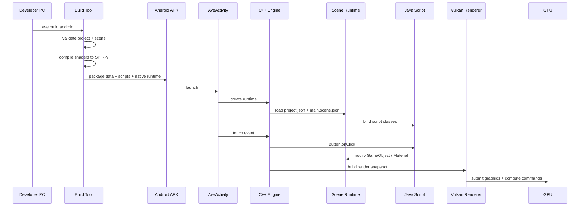

## 一个月 MVP 范围

| 模块 | MVP 范围 |
|---|---|
| `Project Format` | `project.json` + `main.scene.json` + `materials/*.json` |
| `Build Tool` | 校验引用、编译 shader、拷贝资源、调用 Gradle |
| `Scene Runtime` | GameObject hierarchy、Transform、MeshRenderer、Camera、Light |
| `UI Runtime` | Image、Button、ProgressBar，不做字体 |
| `Script Runtime` | Java `Start`、`Update`、`OnClick` |
| `Material System` | basic PBR 参数绑定 |
| `Renderer` | PBR mesh、UI pass、tone mapping |
| `Compute` | GPU particle 或 compute bloom 二选一 |
| `Vulkan RHI` | 最小 device、swapchain、resource、descriptor、pipeline、command、sync |
| `Profiler` | logcat 输出 frame time、pass time、draw call |

## 两人纵向分工

不要按底层/上层切分，而是按完整功能链路切分。

| 人员 | 负责方向 | 完整链路 |
|---|---|---|
| A | Scene + Material + PBR | `scene/material data -> runtime load -> MaterialSystem -> PBR Pass -> Vulkan graphics pipeline` |
| B | UI + Script + Compute | `UI component/script binding -> Java callback -> UI/Compute Pass -> Vulkan compute pipeline` |

共同负责：

```text
Project Format
Engine Runtime lifecycle
Vulkan RHI abstraction
Build pipeline
README / architecture / demo video / performance report
```

## 最终 Demo

```text
PC:
  编辑 project.json、main.scene.json、material.json、PlayerController.java
  运行 ave build android

Android:
  APK 启动
  自动加载场景
  显示 3D 物体 + PBR 材质
  显示图片按钮和进度条 UI
  点击按钮调用 Java 脚本
  触发 compute particle 或 bloom 效果
  Vulkan backend 完全隐藏在 engine 内部
```
