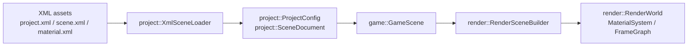

# Ave 数据流与数据结构约定（先定义后实现）

本文用于**先把“从 XML 到渲染”三层数据结构对齐**，后续实现只需要按本文约定补齐解析/转换逻辑即可。

> 目标：清晰分层、避免结构在层间“泄漏”，并且让渲染层只接收它真正关心的、可稳定缓存/复用的输入。

---

## 1. 分层与边界

我们把运行时拆成 3 层数据形态（同一份信息在不同层会有不同的表示）：

1) **Authoring/解析层（XML -> Project）**  
   - 输入：`project.xml`、`*.scene.xml`、`*.material.xml` 等文本资源  
   - 输出：`ave::project::*Data`（“内容描述/作者数据”）  
   - 特点：字段以“可序列化/可编辑”为主，使用字符串 id/路径做引用，不出现 GPU/平台句柄。

2) **Game/逻辑层（Project -> GameScene）**  
   - 输入：`ave::project::SceneDocument`（以及未来的材质/资源描述）  
   - 输出：`ave::game::GameScene`（对解析数据的运行时封装，提供查询/遍历便利）  
   - 特点：仍然不持有 GPU 资源；可以做派生缓存（例如 parent/children 查找表）。

3) **Render/渲染层（GameScene -> RenderWorld + 资源句柄）**  
   - 输入：逻辑层可遍历的实体 + 已解析的资源描述  
   - 输出：`ave::render::RenderWorld`（每帧快照） + `MaterialSystem`/`FrameGraph`/Mesh&Texture 资源表  
   - 特点：渲染层只接收渲染需要的信息（矩阵、材质 id、mesh id、灯光、相机等），并把“资源加载/编译”与“每帧提交”分开。

Mermaid 总览：

---

## 2. XML 读取后应该封装成什么结构（解析层输出）

### 2.1 现阶段（已经存在的最小闭环）

目前工程里已经存在并在 Android runtime 中使用的两份结构：

- `ave::project::ProjectConfig`（见：`include/ave/project/ProjectConfig.h`）
  - 用途：从 `project.xml` 读取 app 级配置（name、package、入口场景路径、横竖屏等）
  - 关键字段：
    - `name`
    - `package_name`
    - `entry_scene`（如 `scenes/main.scene.xml`）
    - `orientation`
  - 对应样例：`sample/TriangleGame/project.xml`

- `ave::project::SceneDocument`（见：`include/ave/project/SceneDocument.h`）
  - 当前别名：`using SceneDocument = SceneData;`
  - 实体结构来源：`include/ave/project/SharedDataContract.h` 中的 `SceneData / GameObjectData / ComponentData ...`
  - 用途：从 `*.scene.xml` 读取场景环境、GameObject、组件数据
  - 对应样例：`sample/TriangleGame/scenes/main.scene.xml`

> 约定：**解析层只产出 `project::*Data`（Authoring 数据）**，不要在解析层做“渲染资源创建/上传”。

### 2.2 推荐的统一封装（后续扩展用）

当我们开始引入材质、纹理、网格、脚本等外部资源文件时，建议解析层统一产出一个“内容包”：

- `ave::project::SharedDataContract`
  - 位置：`include/ave/project/SharedDataContract.h`
  - 含义：把 project/scene/materials/meshes/textures/scripts 等解析结果放到一个容器里，作为“内容数据库”的最小单位。

推荐两种装配方式（二选一即可）：

1) **一次性装配**：`LoadProjectBundle(project.xml) -> SharedDataContract`  
   - 优点：调用端简单，后续做资源依赖分析方便  
   - 缺点：需要定义清晰的“引用解析规则”（scene 引用 material、material 引用 texture/shader 等）

2) **分文件装配**：先 `LoadProject`/`LoadScene`，再逐步 `LoadMaterial`/`LoadTexture`... 最终汇总成 `SharedDataContract`  
   - 优点：实现可渐进  
   - 缺点：调用端需要一个装配器/缓存层

本文后续章节默认使用 **SharedDataContract 作为最终解析层聚合输出**，即使短期内你只填充其中的 `project` 和 `scene`。

---

## 3. 传给下一层（逻辑层）应该是什么结构

逻辑层的核心诉求是：

- 提供稳定的“可遍历场景实体”接口
- 可选地提供派生缓存（按 id 查对象、按 parent 查 children、按组件类型过滤等）
- 不引入 GPU/平台句柄

现有结构已经满足最小要求：

- `ave::game::GameScene`
  - 位置：`include/ave/game/GameObject.h`、`src/game/GameObject.cpp`
  - 输入：`project::SceneDocument`
  - 输出：`Objects()` 返回 `std::vector<GameObject>`（对 `project::GameObjectData` 的轻量封装）

推荐约定（用于后续扩展）：

1) **逻辑层入口**：  
   - `GameScene::Load(project::SceneDocument document)`（已有）
2) **逻辑层持有的数据**：  
   - `project::SceneDocument` 原始文档（用于调试/热重载/序列化回写）
   - `std::vector<GameObject>` 运行时视图（用于遍历）
3) **逻辑层可选派生缓存（建议但不强制）**：  
   - `unordered_map<string, index>`：id -> object index  
   - `unordered_map<string, vector<string>>`：parent -> children  
   - 组件查询索引（如 camera/light/mesh_renderer 列表）

> 约定：逻辑层默认仍使用 `project::GameObjectData` 作为“组件数据承载”，直到我们需要引入真正的 ECS/组件存储时再拆。

---

## 4. 最终给绘制接口的应该是什么结构（渲染层输入/输出）

渲染层建议拆成两步：

1) **Build 阶段（内容变化时执行）**：  
   - 读取 `SceneDocument`（以及材质/纹理/网格描述）
   - 生成渲染系统内部可缓存的对象/资源映射（mesh/material/texture 的 id 映射）

2) **Submit 阶段（每帧执行）**：  
   - 提交 `RenderWorld`（相机/灯光/可见对象列表等每帧快照）

### 4.1 建议渲染层的“稳定数据结构”

现有渲染侧数据结构（已经在 include 中定义）：

- `ave::render::RenderWorld`
  - 位置：`include/ave/render/RenderWorld.h`
  - 内含：
    - `std::vector<RenderObject>`
    - `std::vector<RenderLight>`
    - `RenderCamera`

- `ave::render::MaterialSystem`
  - 位置：`include/ave/render/MaterialSystem.h`
  - 用途：管理材质模板与实例（按 id/name 查询）

> 约定：**跨层传递时，只传 “id + 参数”**，不要把 Vulkan 对象或 GPU 资源句柄从底层泄漏到上层。

### 4.2 Builder 的输入/输出约定

已经存在的 Builder：

- `ave::render::RenderSceneBuilder`（见：`include/ave/render/RenderSceneBuilder.h`）
  - `BuildFromScene(project::SceneDocument const& scene, RenderSceneConfig const& config)`
  - 输出通过 `GetRenderWorld()/GetMaterialSystem()/GetFrameGraph()` 暴露

推荐把 builder 的输入拆成两类（便于后续演进）：

1) **场景几何/实体输入**：`project::SceneDocument` 或 `game::GameScene`  
2) **资源数据库输入**：`project::SharedDataContract`（至少包含 materials/meshes/textures 的描述）

> 若短期只实现最小闭环：`BuildFromScene(SceneDocument)` 就够；但文档约定仍建议最终以 `SharedDataContract` 作为“资源来源”。

### 4.3 渲染层最小接口（建议）

为了让 Android runtime 里 `MinimalVulkanTriangle` 之后能无缝替换为真正渲染器，建议最终收敛到类似接口：

- `RenderSceneBuilder::BuildFromScene(SceneDocument, RenderSceneConfig)`
- 渲染器每帧只接收：
  - `RenderWorld const&`（对象/灯光/相机快照）
  - `MaterialSystem const&`（材质参数/纹理引用）
  - （可选）Mesh/Texture 的运行时资源句柄表（由资源系统维护）

### 4.4 最小示例：从 `SceneDocument` 到 `RenderWorld`

以 `*.scene.xml` 中的一个 `GameObject`（带 `Transform` + `MeshRenderer`）为例：

- 解析层产出（Authoring）：
  - `project::GameObjectData`
    - `components.transform`：位置/旋转/缩放
    - `components.mesh_renderer`
      - `mesh`：mesh id 或 source
      - `material`：材质文件路径或材质 id（字符串）
      - `vertices/indices`：可选（内嵌网格时）

- 逻辑层持有：
  - `game::GameObject` 只是对 `project::GameObjectData` 的轻量访问包装（当前实现如此）

- 渲染层 Build 阶段转换：
  - 把 `transform` 转成 `RenderObject.world_matrix`
  - 把 `mesh_renderer.mesh` 解析/注册成 `RenderObject.mesh_id`
  - 把 `mesh_renderer.material` 解析/注册成 `RenderObject.material_id`

最终每帧 Submit 阶段，渲染器只关心 `RenderWorld` 里的整数 id 与矩阵等稳定输入。

---

## 5. 字段与引用规则（关键约定）

1) **所有跨文件引用一律用字符串 id 或相对路径**  
   - 解析层不做 GPU 资源创建  
   - 渲染层拿到的应该是“已解析并注册后的整数 id”（例如 material_id、mesh_id）

2) **解析层负责保证语义完整性**（能报错就尽早报错）  
   - 缺失 id、重复 id、循环层级引用、材质引用缺失等应在解析/装配阶段给出明确错误

3) **渲染层不关心 XML 细节**  
   - XML 的可选字段/默认值属于解析层职责  
   - 渲染层只吃稳定的 `RenderWorld/MaterialSystem` 等

---

## 6. 现有代码落点（方便实现时对照）

- XML 解析：`include/ave/project/XmlSceneLoader.h`、`src/project/XmlSceneLoader.cpp`
- Authoring 数据结构：`include/ave/project/SharedDataContract.h`
- 逻辑层封装：`include/ave/game/GameObject.h`、`src/game/GameObject.cpp`
- 渲染侧输入结构：`include/ave/render/RenderWorld.h`、`include/ave/render/MaterialSystem.h`
- 场景到渲染转换：`include/ave/render/RenderSceneBuilder.h`、`src/render/RenderSceneBuilder.cpp`
